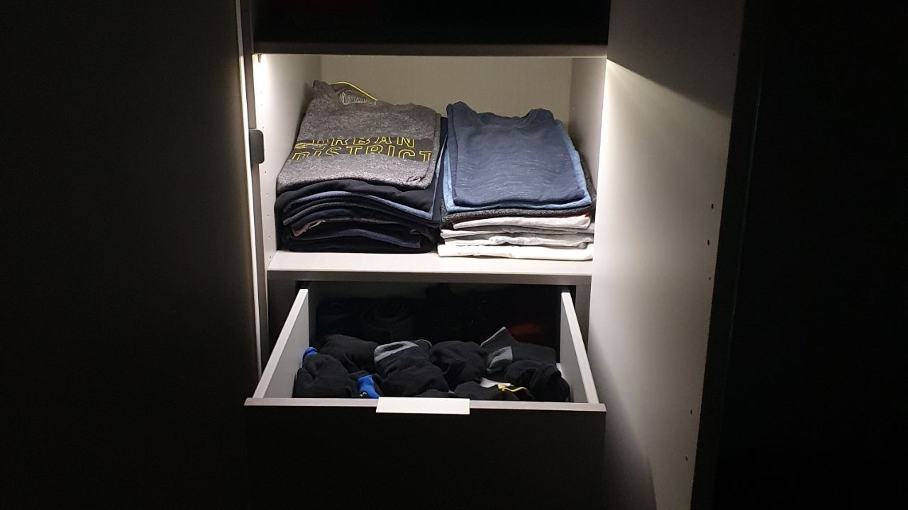
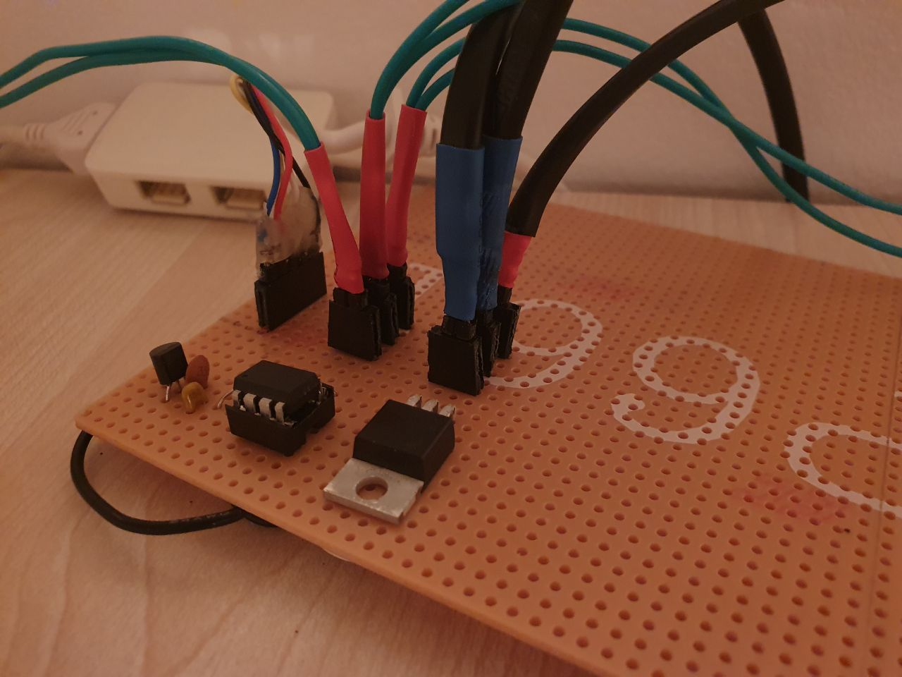
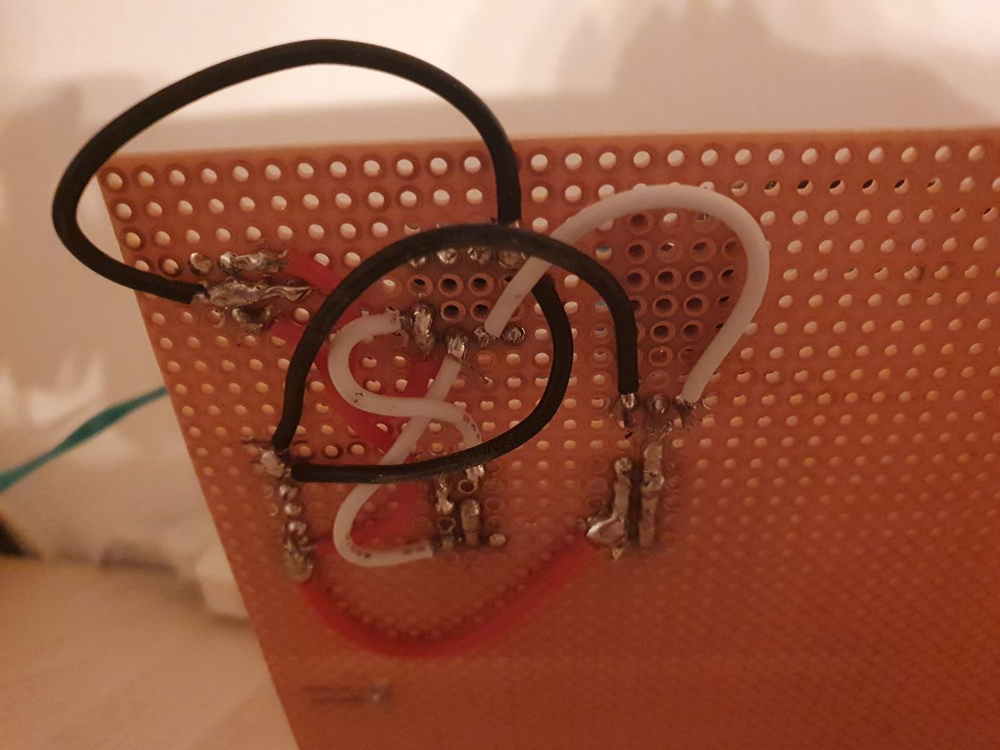

# DIY Wardrobe Light

Just a simple wardrobe lighting project that iluminated your clothes when you open a door.
Pretty neat to not wake up your partner when you search your clothes early in the morning.

The nice thing is, that the light smoothly fades in and out when you open the door. This definetly does give it a premium touch.

  

## Hardware

### Components

- [ ] 1x [BUZ11-NR4941 MOSFET](https://www.conrad.de/de/p/on-semiconductor-buz11-nr4941-mosfet-1-n-kanal-75-w-to-220-3-151334.html) or a similar N-Channel Mosfet that can be controlled with 5V and can handle the wattage of your LEDs
- [ ] [12V LED Strips](https://www.amazon.de/gp/product/B00HSF65EA) (I recommend <= 2700k)
- [ ] [Reed Sensor](https://www.amazon.de/gp/product/B07Z4NCWDD) (1x per Door that should trigger the light)
- [ ] Arduino compatible microcontroller (I used an Attiny45)
- [ ] a lot of cables
- [ ] some tape to hold the cables in place within the wardrobe
- [ ] breadboard
- [ ] heat shrink tubing or electrical tape (optional)

If your uC can not handle the LED supply voltage on it's own you will also need some way to step down the voltage. I used the [LM7805 with approriate capacitors](https://i.gyazo.com/5f76eaea0f2867000fb4e6d825d8bb6f.png).

- [ ] LM7805 voltage regulator
- [ ] 0.33uF Capacitor
- [ ] 0.1uF Capacitor

### Tools

- [ ] soldering iron
- [ ] scissors
- [ ] knive
- [ ] nippers

### Wiring

TODO but basicly you just connect the Arduino and the LEDs with the MOSFET and the REED switches in series to each other from the Arduino Voltage (mostly 5V or 3.3V) to any input pin.

It's similar to this image from stackexchange.com:

  

In real it looks like this mess:

  
  

## Software

Just flash the code from the code directory onto your arduino compatible microcontroller. Be aware that not all pins are PWM compatible, so adjust the pin defintions wisely. Feel free to adjust all the parameters to your likings.

## Future Improvements

There are a couple of things you could improve

- [ ] individual door control. I currently turn on all lights whenever any door opens. I did this to safe me some soldering time and because I only had one transistor lying around. It's also not that big of a problem because you often don't see the lights behind a closed door.
- [ ] Fade in slower than fading out. It currently feels like the opening is a bit to fast and the dimming a bit to slow. Defining those differences in Software should be easy.
- [ ] I would definetly use some other LED strips. I personally think the ones I received are a bit low quality and a bit whiter than they claimed. They should have a CRI rating greater than 90. I have very good experience with [these ones from amazon](https://www.amazon.de/dp/B07GSPBC6K/) but they are expensive and with their white temperature range overkill for this project. Expect to pay at least 20€ for 5m of high quality LED strips (excluding the power supply).
